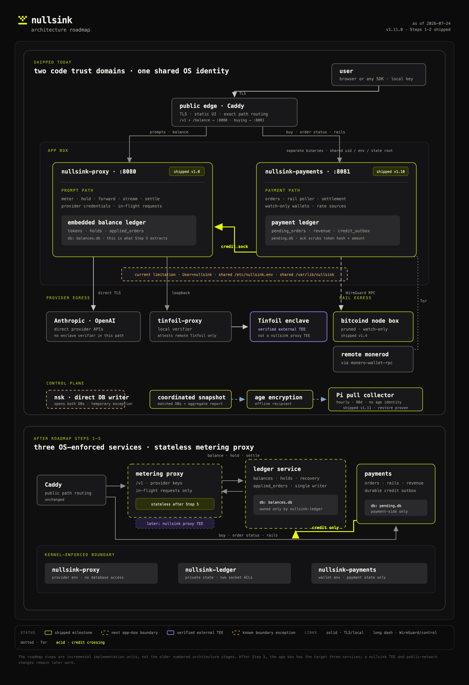

# Architecture roadmap

Status source for [issue #58](https://github.com/nullsink/nullsink/issues/58). The
diagram source is [`architecture-roadmap.html`](architecture-roadmap.html); the rendered
artifact is [`architecture-roadmap.png`](architecture-roadmap.png).

## Status — 2026-07-24, v1.11.0

| Milestone | State | Evidence / remaining boundary |
| --- | --- | --- |
| Dedicated Bitcoin node box | **Shipped** in v1.4.x | `deploy/node-box-runbook.md`; RPC crosses WireGuard. |
| Proxy/payments process split | **Shipped** in v1.8.0 | Two binaries, two HTTP ports, path routing, transactional credit outbox. |
| Payment→prompt credit crossing | **Shipped** | At-least-once delivery over a pathname Unix socket; `applied_orders` makes application idempotent. |
| Delivered-link scrubbing | **Shipped** in v1.10.1 | Definite ack atomically clears hash/amount; 11 legacy acknowledgements migrated idempotently in production; restores verify tombstones against the ledger. |
| Financial and backup egress | **Shipped and recovery-proven** in v1.11.0 | Production publishes encrypted pairs through restricted read-only `rrsync`; the Pi pulls hourly, retains 90 days, and holds no `age` identity. Manual and scheduled pulls plus an offline dry-run restore passed in production. |
| Separate OS principals | **Not started** | Proxy and payments still share `User=nullsink`, `/etc/nullsink.env`, and `/var/lib/nullsink`. |
| Ledger service | **Not started** | The proxy still owns `balances.db`, holds, and `applied_orders`. |
| Stateless metering proxy | **Blocked on ledger extraction** | This is the app-box target reached after roadmap steps 1–5 below. |
| nullsink proxy TEE | **Later feasibility work** | Distinct from the live Tinfoil verifier, which attests only Tinfoil's remote enclave. |
| Public onion / geographic relay | **Later network work** | Not part of the five app-box steps below. |

## Current boundary

Production is two application processes on one box:

- `nullsink-proxy` serves `/v1/*` and `/balance`, holds provider credentials, and owns
  `balances.db` (`tokens`, `holds`, `applied_orders`).
- `nullsink-payments` serves `/buy`, `/order-status`, and `/rails`, runs the rail poller,
  and owns `pending.db` (`pending_orders`, `revenue`, `credit_outbox`).
- Payments delivers one command—`credit { hash, micros, idempotency_key }`—to the proxy.
  The durable outbox makes delivery retryable; the receiving ledger makes replay harmless.
- Runtime dependency-closure tests keep prompt code out of the payments binary and payment
  code out of the proxy binary.

This is an application-level trust boundary, not yet an OS security boundary. Both units run
under the same Linux identity and read the same environment file. `nsk` is the explicit
cross-boundary exception: operator commands may open both databases directly.

Provider routing is deliberately asymmetric. Anthropic and OpenAI are reached directly over
TLS. Only Tinfoil traffic traverses the local `tinfoil-proxy`, which attests Tinfoil's remote
enclave. That upstream verification is not attestation of nullsink itself.

## The five app-box steps

Each step should ship independently and retain the money-safety invariants.

### 1. Fix the privacy lifecycle — shipped in v1.10.1

Retain the payment→token link only while an order is open or a credit is still owed. After a
definite ledger acknowledgement, scrub the delivered outbox payload while retaining the
idempotency tombstone required to reject duplicate delivery. Document the exact live-data and
backup-retention guarantees before shipping forensic tooling.

Gate: an ambiguous delivery still replays safely; a definite acknowledgement leaves no direct
delivered payment→token link in current database rows. Covered by outbox, socket-drain, migration,
and backup/restore contract tests.

### 2. Define financial and backup egress — shipped in v1.11.0

Treat backups as a control-plane path, not an application API: create a coordinated SQLite
snapshot, encrypt it to an offline `age` recipient, and optionally push the ciphertext off-box.
Off-box reporting should expose revenue, liability, snapshot integrity, and open/undelivered
credit diagnostics without rebuilding a permanent delivered-payment→token history.

Gate: matched-pair restore succeeds; plaintext is private and temporary; reports contain only
the fields allowed by the privacy lifecycle.

The production slice shipped in v1.10.1: four-hour pending-first/ledger-second snapshots are validated
before atomic publication; an offline-recipient `age` artifact is paired with a versioned report containing
only daily/asset revenue, aggregate liability, and open/undelivered-credit health.

The role-specific `deploy/backup-collector/` bundle completes the independent-storage slice. Production
exposes only finalized files through a forced read-only `rrsync` command. The Pi initiates an hourly pull,
keeps 90 days, rejects stale or schema-expanded report pairs, records a privacy-safe success marker, and
optionally pings a dead-man switch. It never receives the private `age` identity.

The operational gate passed on 2026-07-24: the restricted manual pull validated the newest pair, systemd
completed the first scheduled pull, and a retained Pi ciphertext passed the reviewed release's dry-run
restore on the trusted machine with the offline identity. No plaintext database or decryption identity
crossed into the collector.

### 3. Retire direct database access by `nsk`

Move issue/top-up onto an operator-authenticated administrative outbox that uses the same one-way
credit crossing. Replace balance and financial direct reads with narrow read interfaces or
offline snapshot reporting. The raw token is minted locally; only its hash crosses the admin path.

Gate: no operator command needs write access to both live databases.

### 4. Enforce OS privilege separation

Run proxy and payments under different Linux users, with separate environment files and state
directories. Grant socket access explicitly with a dedicated group or ACL. A compromised payments
process must not be able to read provider keys or `balances.db`; a compromised proxy must not be
able to read wallet credentials or `pending.db`.

Gate: deployment tests prove the file and socket permission matrix, not only the TypeScript import
matrix.

### 5. Extract the ledger service

Create a third process that exclusively owns `balances.db`, hold recovery, and `applied_orders`.
Give the proxy a narrow balance/hold/settle socket and give payments a distinct credit-only socket.
The proxy then becomes stateless: provider keys and in-flight requests are its only sensitive
runtime material.

Gate: no-overdraft and hold-recovery tests run through the socket-backed store; a ledger outage
fails inference before upstream forwarding; payments keeps paid credits queued until recovery.

After Step 5 the app box has the target three units: stateless metering proxy, ledger service, and
payments service. Putting the proxy in a TEE and changing the public network edge remain later,
separate decisions.

## Equal primary rails

Monero and Bitcoin already share the rail interface, `/rails` discovery, checkout picker, and
coin-agnostic settlement core. The remaining code slice is small: optional per-rail buy limits,
limits returned by `/rails`, selected-rail client validation, and symmetric tests. Completion also
needs an operational gate—both rails enabled in production, health checks passing, and a small
end-to-end deposit on each—so enabling both should not become a repository default for boxes that
have no Bitcoin node configured.

## Invariants that survive every step

- No broker and no distributed transaction: the payments outbox is the queue.
- Revenue stays payment-side; balances and `applied_orders` stay ledger-side.
- Payment→prompt traffic has one semantic verb: `credit`.
- The proxy never imports payment endpoints, orders, rails, or revenue code.
- The payments service never imports providers, metering, holds, or the balance store.
- Watch-only wallets remain incapable of spending.
- Tinfoil's external enclave verification is never presented as nullsink proxy attestation.
