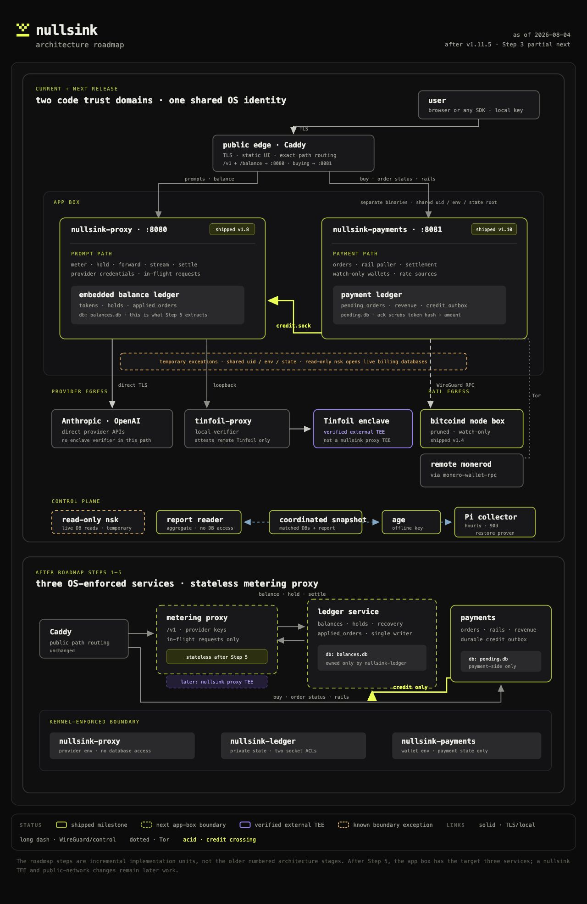

# Architecture roadmap

Status source for [issue #58](https://github.com/nullsink/nullsink/issues/58). The
diagram source is [`architecture-roadmap.html`](architecture-roadmap.html); the rendered
artifact is [`architecture-roadmap.png`](architecture-roadmap.png).

## Status — 2026-08-11, after production v1.13.0

| Milestone | State | Evidence / remaining boundary |
| --- | --- | --- |
| Dedicated Bitcoin node box | **Shipped** in v1.4.x; packaging cleanup merged | The remote watch-only node is reached over WireGuard. Main now packages node day-two assets separately and carries no app-box bitcoind management. |
| Proxy/payments process split | **Shipped** in v1.8.0 | Two binaries, two HTTP ports, path routing, transactional credit outbox. |
| Payment→prompt credit crossing | **Shipped** | At-least-once delivery over a pathname Unix socket; `applied_orders` makes application idempotent. |
| Delivered-link scrubbing | **Shipped** in v1.10.1 | Definite ack atomically clears hash/amount; 11 legacy acknowledgements migrated idempotently in production; restores verify tombstones against the ledger. |
| Financial and backup egress | **Shipped and recovery-proven** in v1.11.0 | Production publishes encrypted pairs through restricted read-only `rrsync`; the Pi pulls hourly, retains 90 days, and holds no `age` identity. Manual and scheduled pulls plus an offline dry-run restore passed in production. |
| Operator database access | **Reduced in v1.12.0** | Mutating/recovery commands are retired. Two read-only live views remain temporarily: balances and financials. |
| Separate OS principals | **Shipped and production-proven** in v1.13.0 | Distinct users, root-owned env files, state roots, read groups, and credit-socket group. Production passed the permission matrix, encrypted post-migration backup, and offline restore drill. |
| Ledger service | **Implementation ready; QA pending** | A dedicated third binary owns `balances.db` and two ACL-separated Unix sockets. Staging, release, and production recovery proof remain. |
| Stateless metering proxy | **Implementation ready; QA pending** | Proxy opens no database, completes a transactional session-start barrier before binding HTTP, and drains while ledger remains available. |
| nullsink proxy TEE | **Later feasibility work** | Distinct from the live Tinfoil verifier, which attests only Tinfoil's remote enclave. |
| Public onion / geographic relay | **Later network work** | Not part of the five app-box steps below. |

## Current production boundary after Step 4

Production is two application processes on one box:

- `nullsink-proxy` serves `/v1/*` and `/balance`, holds provider credentials, and owns
  `balances.db` (`tokens`, `holds`, `applied_orders`).
- `nullsink-payments` serves `/buy`, `/order-status`, and `/rails`, runs the rail poller,
  and owns `pending.db` (`pending_orders`, `revenue`, `credit_outbox`).
- Payments delivers one command—`credit { hash, micros, idempotency_key }`—to the proxy.
  The durable outbox makes delivery retryable; the receiving ledger makes replay harmless.
- Runtime dependency-closure tests keep prompt code out of the payments binary and payment
  code out of the proxy binary.

Linux now enforces the application boundary. The two units run as distinct principals, load separate
root-owned environment files, and own separate state roots. Neither service can read the other service's
database or secrets. Payments can reach only the proxy-owned credit socket through `nullsink-credit`.

Two bounded read-only exceptions remain: the `nullsink` operator principal can run `nsk balances` and
`nsk financials`, and the dedicated backup principal can create coordinated snapshots. Their supplemental
groups grant database reads but no writes. Step 5 replaces the proxy-owned balance database with a ledger
service interface, which also enables retirement of the temporary live `nsk` readers.

Provider routing is deliberately asymmetric. Anthropic and OpenAI are reached directly over
TLS. Only Tinfoil traffic traverses the local `tinfoil-proxy`, which attests Tinfoil's remote
enclave. That upstream verification is not attestation of nullsink itself.

## The five app-box steps

Each step should ship independently and retain the money-safety invariants.

### 1. Fix the privacy lifecycle — shipped in v1.10.1

Retain the payment→token link only while an order is open or a credit is still owed. After a
definite ledger acknowledgement, scrub the delivered outbox payload while retaining the
idempotency tombstone required to reject duplicate delivery. Document the exact live-data and
backup-retention guarantees before shipping forensic tooling.

Gate: an ambiguous delivery still replays safely; a definite acknowledgement leaves no direct
delivered payment→token link in current database rows. Covered by outbox, socket-drain, migration,
and backup/restore contract tests.

### 2. Define financial and backup egress — shipped in v1.11.0

Treat backups as a control-plane path, not an application API: create a coordinated SQLite
snapshot, encrypt it to an offline `age` recipient, and optionally push the ciphertext off-box.
Off-box reporting should expose revenue, liability, snapshot integrity, and open/undelivered
credit diagnostics without rebuilding a permanent delivered-payment→token history.

Gate: matched-pair restore succeeds; plaintext is private and temporary; reports contain only
the fields allowed by the privacy lifecycle.

The production slice shipped in v1.10.1: four-hour pending-first/ledger-second snapshots are validated
before atomic publication; an offline-recipient `age` artifact is paired with a versioned report containing
only daily/asset revenue, aggregate liability, and open/undelivered-credit health.

The role-specific `deploy/backup-collector/` bundle completes the independent-storage slice. Production
exposes only finalized files through a forced read-only `rrsync` command. The Pi initiates an hourly pull,
keeps 90 days, rejects stale or schema-expanded report pairs, records a privacy-safe success marker, and
optionally pings a dead-man switch. It never receives the private `age` identity.

The operational gate passed on 2026-07-24: the restricted manual pull validated the newest pair, systemd
completed the first scheduled pull, and a retained Pi ciphertext passed the reviewed release's dry-run
restore on the trusted machine with the offline identity. No plaintext database or decryption identity
crossed into the collector.

### 3. Retire operator mutation; narrow live reads — partial, shipped in v1.12.0

Delete issue, top-up, order inspection, and recovery commands instead of building an administrative
outbox. The normal `/buy` flow handles initial and repeat funding. Keep only the two actively used,
read-only live views: per-token balances and the sales/liability financial view. They are on-box tools;
stable token hashes and exact sale rows never enter retained reports.

Finalized aggregate reports remain the routine off-box view. The local report reader validates the exact
schema and shows sales, liability, open orders, and undelivered-credit diagnostics without opening SQLite.
The obsolete Bitcoin recovery runbook is removed; generate a bounded procedure from live topology if an
exceptional recovery is required.

Gate for this slice: the released CLI exposes exactly `balances` and `financials`, neither can write, and
all funding uses `/buy`. Remaining gate: replace both database readers with service-owned read interfaces
during OS separation and ledger extraction, then retire `nsk`.

### 4. Enforce OS privilege separation — shipped in v1.13.0

Run proxy and payments under different Linux users, with separate environment files and state
directories. Grant socket access explicitly with a dedicated group or ACL. A compromised payments
process must not be able to read provider keys or `balances.db`; a compromised proxy must not be
able to read wallet credentials or `pending.db`.

Production uses `nullsink-proxy`, `nullsink-payments`, and `nullsink-backup` principals; separate
proxy/payments/backup/monitor env files; separate state roots; read-only groups for the temporary operator
views and coordinated backup; and a `nullsink-credit` group that grants payments access only to the credit
socket. The migration completed during a financial quiet window, preserved both database fingerprints,
passed the live permission matrix, and produced an encrypted post-migration artifact that passed an offline
restore dry run. The obsolete shared layout was then finalized and removed.

Gate: deployment tests prove the file and socket permission matrix, not only the TypeScript import
matrix.

### 5. Extract the ledger service — implementation ready; not production-proven

Create a third process that exclusively owns `balances.db`, hold recovery, and `applied_orders`.
Give the proxy a narrow balance/hold/settle socket and give payments a distinct credit-only socket.
The proxy then becomes stateless: provider keys and in-flight requests are its only sensitive
runtime material.

Gate: no-overdraft and hold-recovery tests run through the socket-backed store; a ledger outage
fails inference before upstream forwarding; payments keeps paid credits queued until recovery.

The implementation stays deliberately narrow: one ledger process, two versioned pathname sockets, one fresh
proxy session per process, and no broker, lease, or generic RPC framework. Mutations retry the identical
session/hold/payload after an ambiguous response. A new proxy cannot bind HTTP until `startSession` returns a
definite success; that transaction fences retired sessions and refunds a stopped/crashed predecessor's holds.
Systemd starts ledger before both callers and stops it after proxy's bounded drain.

The one-time cutover stops Caddy first, copies the old proxy-owned ledger with integrity and logical-fingerprint
checks, and keeps a frozen pre-traffic rollback copy. Any failure before activation restores the old topology;
activation requires all three units plus both sockets; finalization waits for an encrypted backup and offline
restore proof. The remaining operator follow-up is replacing the temporary read-group `nsk` exception with
service-owned read interfaces, then retiring live database readers.

After Step 5 the app box has the target three units: stateless metering proxy, ledger service, and
payments service. Putting the proxy in a TEE and changing the public network edge remain later,
separate decisions.

## Equal primary rails

Monero and Bitcoin already share the rail interface, `/rails` discovery, checkout picker, and
coin-agnostic settlement core. The remaining code slice is small: optional per-rail buy limits,
limits returned by `/rails`, selected-rail client validation, and symmetric tests. Completion also
needs an operational gate—both rails enabled in production, health checks passing, and a small
end-to-end deposit on each—so enabling both should not become a repository default for boxes that
have no Bitcoin node configured.

## Invariants that survive every step

- No broker and no distributed transaction: the payments outbox is the queue.
- Revenue stays payment-side; balances and `applied_orders` stay ledger-side.
- Payment→prompt traffic has one semantic verb: `credit`.
- The proxy never imports payment endpoints, orders, rails, or revenue code.
- The payments service never imports providers, metering, holds, or the balance store.
- Watch-only wallets remain incapable of spending.
- Tinfoil's external enclave verification is never presented as nullsink proxy attestation.
