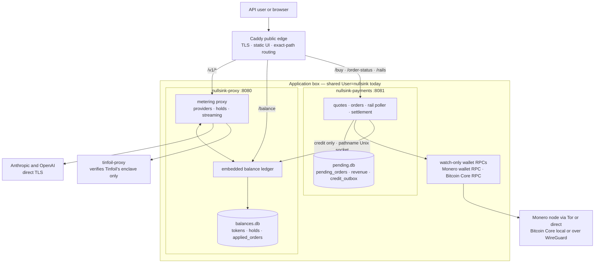

# System boundaries

## What runs in the shipped topology?

Two application binaries run behind Caddy. `nullsink-proxy` owns model traffic and the balance
ledger. `nullsink-payments` owns purchase traffic, payment settlement, and the durable credit
outbox. The ledger is a module inside the proxy process, not a third service. Enabled providers and
rails remain deployment configuration.



The arrows describe application ownership. Caddy still sends `/balance` to port 8080, where the
proxy router calls the embedded ledger.

## Who owns each public route and durable store?

| Owner | Public responsibility | Durable state | Sensitive configuration |
| --- | --- | --- | --- |
| Caddy | TLS, static UI, exact routing | Release files and certificates; no billing database | Public domain and certificate state |
| `nullsink-proxy` | `/v1/messages`, `/v1/chat/completions`, `/v1/responses`, `/v1/models`, `/balance` | `balances.db`: token hashes, balances, holds, and applied-credit markers | Provider credentials |
| `nullsink-payments` | `/buy`, `/order-status`, `/rails` | `pending.db`: open orders, revenue, outbox payloads, and delivered tombstones | Rail RPC and rate-source credentials |
| Watch-only wallet RPCs | Mint addresses and report incoming transfers; no public HTTP route | Watch-only wallet files and generated-address metadata | Node and wallet RPC credentials; no spend key |

The optional `nsk` CLI is the deliberate exception to single ownership: its issue, top-up, balance,
and financial commands open one or both live databases directly. Retiring that exception is a target
architecture step.

## What crosses the proxy/payments boundary?

One application message crosses from payments to the embedded ledger:

```text
credit { hash, micros, idempotency_key }
```

It travels over the owner-only pathname socket at `/run/nullsink/credit.sock`. Prompts, model
responses, provider credentials, payment addresses, coin amounts, and wallet credentials do not
cross that socket. The payment-derived idempotency key does cross and remains in both marker tables;
the token hash and credit amount are scrubbed from the payments row after a definite ledger
acknowledgement.

The delivery and retry contract has one canonical home:
[Money and reliability invariants](invariants.md#how-does-a-confirmed-payment-become-spendable-credit).

## Which boundaries are enforced today?

| Boundary | Current enforcement | What it does not provide |
| --- | --- | --- |
| HTTP ownership | Separate routers, ports, binaries, and exact Caddy routes; unmatched paths fail closed | A separate operating-system identity |
| Code ownership | Dependency-closure tests prevent payment modules entering the proxy binary and provider/metering modules entering payments | Protection from a process already running as the shared `nullsink` user |
| Database ownership | Each application process opens only its own database | File isolation: both units share `User=nullsink`, `/etc/nullsink.env`, and `/var/lib/nullsink` |
| Credit socket | Pathname socket created owner-only; one wire version and one `credit` endpoint | Authentication between separate users; both services currently connect as the same UID |
| Upstream verification | `tinfoil-proxy` verifies Tinfoil's published enclave | Attestation of nullsink itself, or verification of Anthropic/OpenAI traffic |

Treat the proxy/payments split as an application trust boundary, not an OS sandbox. The target that
adds separate service identities and extracts the ledger is tracked in
[Target architecture](architecture-roadmap.md).

## Where is the behavior documented canonically?

| Question | Canonical document |
| --- | --- |
| How are requests priced and held? | [Billing model](billing-model.md) |
| What happens when credit delivery fails? | [Money and reliability invariants](invariants.md#what-happens-when-credit-delivery-fails) |
| What must backup and restore preserve? | [Back up and restore billing state](operators/backup-restore.md) |
| What privacy claims follow from these boundaries? | [Trust model](trust-model.md) |
| What changes before the proxy becomes stateless? | [Target architecture](architecture-roadmap.md) |
