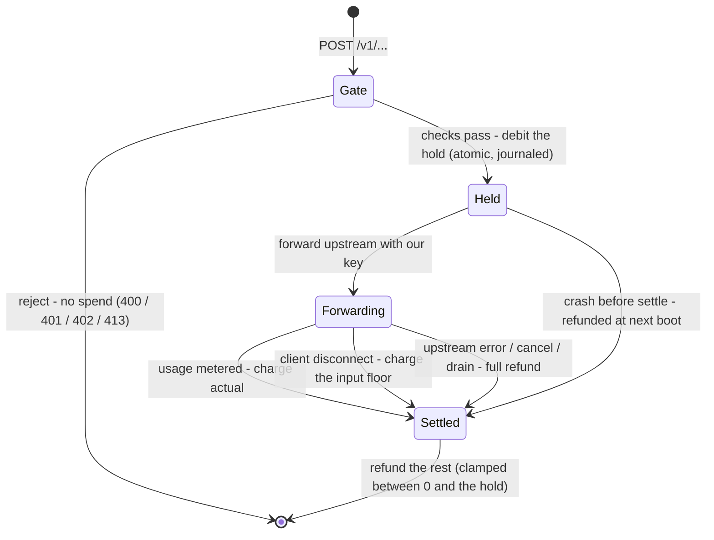

# Billing model

This is the money path: how a request is priced, how nullsink reserves credit up front,
and how it settles — and why a balance can never go negative. It's the deep-dive behind the
no-overdraft promise in [trust-model.md](trust-model.md); see [architecture.md](architecture.md)
for where these steps sit in the request lifecycle.

## Money is integer micro-dollars

All balances and prices are integers in micro-dollars (millionths of a dollar; 1,000,000 =
$1.00) — no floats. Rates are micro-dollars per million tokens, so `cost = tokens × rate /
1,000,000`, and the division **truncates in the user's favor** (`cost/pricing.ts`, `costOf`).

The metered path bills **pure upstream cost** — exactly what the provider charges us, with no
markup. The margin lives at top-up: `POST /buy` quotes `credit_usd × MARGIN` worth of crypto
for the credit you receive (`endpoints/buy.ts`).

A token's balance is permanent: credit never expires, and a refund — the unused part of a hold,
or a request that ends up billing nothing — always returns to the same token.

## The rate card

`cost/pricing.ts` imports `prices.json` once at startup, so billing is deterministic — never a
live price fetch mid-request. Each model lists input, output, cache-read, and cache-write rates.
Don't hand-edit `prices.json` — regenerate it with the dev-only `bun run cli/sync-prices.ts`,
then review the diff and commit it. All providers (Anthropic, OpenAI, and Tinfoil) are synced from
models.dev into the one `prices.json`; Tinfoil is flat — no cache discount, so cached reads bill at
the input rate. A duplicate model id across providers is a hard error at sync time — the tripwire
for when an id is served by more than one provider.

A request's model is matched by exact id or dated suffix, longest match first — `claude-opus-4-1`
matches `claude-opus-4-1-20250805` but not `claude-opus-4-12345`. Each provider reports usage in
its own shape, so nullsink normalizes them into one canonical form (`cost/usage/`) before pricing.

## Caching

Prompt caching is the biggest lever you have on what a request costs. Reusing a large, stable
prefix — a long system prompt, a document, a tool schema — lets the provider serve those repeated
tokens at a fraction of the input rate. nullsink passes both sides through at the exact upstream
rate:

- **Cache reads** — tokens served from an existing cache entry, billed far below the normal input
  rate. This is where the saving is.
- **Cache writes** — the one-time cost of creating the entry. On Anthropic that's 1.25× the input
  rate for the default 5-minute TTL, 2× for the 1-hour TTL; OpenAI charges no cache-write fee.

Tinfoil bills flat — there's no cache tier to pass through, so a cached token costs the same as a
normal input token.

You decide what gets cached from your own request (the provider's `cache_control` breakpoints) —
nullsink only meters the result. The two providers report cache usage differently (Anthropic's
input count excludes cached tokens, OpenAI's includes them, and Anthropic reports the 1-hour write
slice in a nested field), so nullsink normalizes both before pricing: the cache total is never
double-counted, and the 1-hour slice is billed at its own 2× tier (`cost/pricing.ts`).

## Outside the flat card

The card prices standard input, output, and cache tokens. Anything that bills on a different
axis is rejected at the gate, before any spend — a request nullsink can't price correctly never
reaches the provider (`providers/`):

- **Server-side tools** — web search, code execution / interpreter, file search — carry per-call
  fees beyond per-token rates. Client-side (function) tools are just tokens, so they pass.
- **Premium service tiers** — OpenAI `service_tier` flex/priority; only the standard tier maps to the card.
- **Audio and other non-text modalities** — audio input or output bills far above text rates.
- **Multi-completion** — OpenAI `n` > 1, or Tinfoil/vLLM `best_of` > 1, multiplies output cost past a single-completion hold.
- **Regional routing** — Anthropic `inference_geo`.
- **Off-card models** — `search-preview`, `deep-research`, audio, and realtime model ids.

Request *betas* are stripped before forward; only the flat-rate-safe ones (e.g. Anthropic
context editing) are re-added.

## Order lifecycle

`POST /buy` quotes a coin amount, locks the USD rate, and mints a single-use watch-only address,
storing the order in `pending.db`. The poller (`ledger/settle.ts`) then moves that order through
a small state machine:

```mermaid
stateDiagram-v2
    [*] --> Quoted
    Quoted --> Paying: a deposit appears (any confirmations)
    Quoted --> Unfunded: never seen, age past TTL + grace (default ~4.5h)
    Paying --> Credited: deposit final (rail's confirmations reached)
    Paying --> Stuck: never confirms, age past backstop (default 24h)
    Credited --> [*]: credit the balance, drop the payment-token link
    Unfunded --> [*]: reap the order
    Stuck --> [*]: stop watching the address
```

Crediting is exactly-once (idempotent per deposit) and proportional to the coin actually received
against the locked quote; a confirmed payment closes the order on first sight, so a later top-up
is a fresh order. The two reap paths differ on purpose. An order *never seen* paying is treated as
abandoned and dropped quickly (the unfunded reap). One that *was seen* but never reaches finality —
a dropped or replaced transaction — is the rarer **stuck** case: because a payment was spotted, it's
spared the fast reap and held all the way to the backstop. That extra time is what lets a buyer who
pays at the very edge of their window still get credited; the quoted `expires_at` is the pay-by
deadline, and nullsink keeps watching past it to the reap horizons above.

## The up-front hold

Before forwarding, nullsink debits a **hold**: an upper bound on what the request could cost. It
forwards only if the hold clears, then refunds the difference once the real cost is known. The
hold must be a *sound* upper bound, or a balance could be driven negative. There are two
estimators (`hold.ts`, selected by `HOLD_ESTIMATOR`):

- **Byte bound** (`byteBoundHold`) — prices the request's UTF-8 byte length as if every byte were
  a token, plus `max_tokens × output_rate`. It needs no upstream call and is *provably* sound:
  token counts can't exceed byte counts, and the output is capped by `max_tokens`. It's loose —
  at worst it over-reserves and triggers a spurious "insufficient balance."
- **count_tokens** (default) — asks the provider's *free* token counter for the exact input size
  (Anthropic `POST /v1/messages/count_tokens`; OpenAI `POST /v1/responses/input_tokens`). The
  counter measures the input only — it says nothing about output — so nullsink sizes the hold as
  that count plus `max_tokens × output_rate` on top. The count is a documented estimate, so it's
  padded (~10% + 64 tokens) and **capped at the byte bound**; on any failure — bad response,
  timeout, a count below 1, or an OpenAI chat-completions body the endpoint won't count — it falls
  back to the byte bound. The byte cap and settle-time clamp are what keep it sound.

## Settle, and why a balance can't go negative

Once the hold is debited, every outcome converges on one settle — charge some amount, refund the
rest:

Three invariants carry the no-overdraft guarantee:

1. **The debit is atomic and conditional.** The hold is subtracted in a single statement that
   only succeeds while the balance still covers it (`ledger/db.ts`). Because the check and the
   subtraction are one operation, two concurrent requests on the same token can't both pass on a
   balance that covers only one — which is what keeps a balance from dropping below zero.
2. **The refund is bounded.** Settlement charges the smaller of the real cost and the hold, then
   refunds the difference (`handler.ts`). If the real cost somehow lands *above* the hold — rare,
   and logged — the user is charged only the hold and nullsink absorbs the gap. A negative or
   malformed cost is floored at zero. So the refund always lands between zero and the hold: it can
   neither overdraft the balance nor inflate it.
3. **A crash refunds the stranded hold.** The hold is journaled in the same transaction as the
   debit — a journal row exists exactly while a hold is outstanding. If the process dies between
   debit and settle, the next boot refunds every survivor in full (`recoverHolds`), since its
   request produced no billed response. Settlement is idempotent — it removes the journal row
   first — so a double-settle (say, a shutdown drain racing the natural finish) is a no-op and a
   refund happens at most once.

## Streaming and disconnects

For SSE responses the bytes are relayed untouched while a scanner meters usage off the stream.
Settlement runs once, on whichever happens first: a clean finish (bill exact usage), an upstream
error (full refund), a client cancel, or a force-settle deadline for a client that opens a stream
but never reads it. On an early client disconnect nullsink still bills at least the input it
already paid the provider to ingest (the "input floor"). Reasoning models whose thinking is *hidden*
from the stream (OpenAI's o-series and GPT-5) bill those tokens as output yet never stream them — so
counting the visible characters on an early cut would under-bill. For these a mid-stream disconnect
is billed at the full output cap instead, a sound upper bound. Open-weight reasoning models (Tinfoil)
*do* stream their thinking — as `content`, or in a `reasoning` field the scanner also counts — so
they're metered from the streamed text like any model, no cap needed. (Anthropic extended thinking
needs no special case either: its scanner reads the running output count, thinking included, straight
off the stream.) Graceful shutdown drains still-open streams, billing the
metered partial and refunding the rest.

## Invariants

A balance can't go negative — the conditional debit and the bounded refund guarantee that on
their own, whatever the hold estimate happens to be.

Every claim above is pinned by property tests in `test/` (`billing`, `hold`, `settle`, `db`)
plus the `reasoning-disconnect` case.
