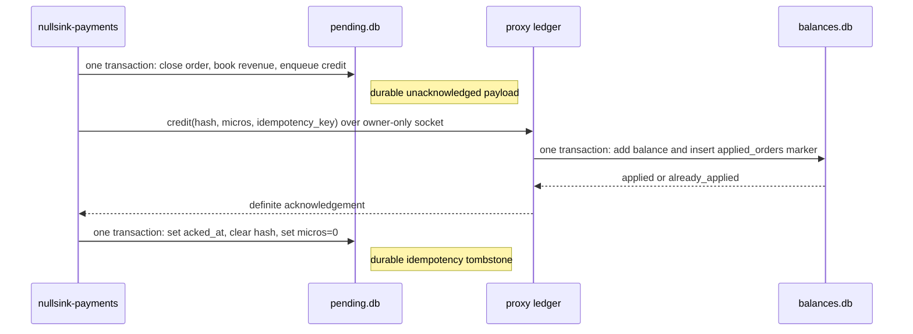

# Money and reliability invariants

Use these rules when changing billing, payment settlement, credit delivery, or recovery. They are
review gates: if a change breaks one, it needs a new design rather than a documentation exception.

## Can a model request overdraw a balance?

No. The proxy must preserve all three parts of the hold protocol:

1. Open the hold before forwarding. The balance debit is conditional and the debit plus hold-journal
   entry commit in one transaction.
2. Settle once. The refund is clamped to the range from zero to the original hold. If measured cost is
   higher than the hold, nullsink absorbs the difference.
3. Recover after a crash. Before serving traffic, the proxy refunds journaled holds left by an
   ungraceful stop.

The implementation lives in
[`ledger/db.ts`](../core/src/ledger/db.ts) and [`handler.ts`](../core/src/handler.ts).

## How does a confirmed payment become spendable credit?

The socket delivery is at least once. The ledger effect is exactly once because the balance increase
and `applied_orders` marker commit together. Payments acknowledges and scrubs an outbox row only after
the ledger returns `applied` or `already_applied`.

See [`ledger/orders.ts`](../core/src/ledger/orders.ts),
[`credit-sender.ts`](../core/src/credit-sender.ts), and
[`credit-server.ts`](../core/src/credit-server.ts).

## What happens when credit delivery fails?

| Failure point | What is retried? | Ambiguous to the sender? | What remains durable? |
| --- | --- | --- | --- |
| Settlement transaction fails | The rail observes the still-open order again on a later poll | No credit attempt occurred | The open order remains; revenue and outbox are both absent because the transaction rolled back |
| Payments stops after settlement commits but before sending | The oldest outbox row is sent on startup or the next poll | No send attempt occurred | Closed order, revenue row, and unacknowledged payload in `pending.db` |
| Socket is unavailable, resets, times out, or returns an unrecognised response | The same oldest row is sent again on the next poll | Yes—the ledger may have committed without returning a usable response | Unacknowledged payload; possibly also the balance and `applied_orders` marker |
| Proxy rejects a wire-version or payload mismatch | The same oldest row is attempted again; later rows wait behind it | Treated as ambiguous because no accepted acknowledgement was returned | The complete outbox row and every later queued row; the stall-age alert keeps increasing |
| Ledger commits, then the response or payments process is lost before outbox acknowledgement | The unacknowledged row is sent again | Yes | Both halves: complete outbox row plus credited balance and `applied_orders` marker |
| Redelivery reaches an existing `applied_orders` marker | Payments receives `already_applied`, then acknowledges and scrubs the row | No | Balance is unchanged; marker remains; outbox becomes a scrubbed tombstone |
| Payments receives `applied` | Nothing further is delivered for that row after acknowledgement succeeds | No | Credited balance and marker in `balances.db`; scrubbed tombstone in `pending.db` |

The sender drains oldest first and stops at the first non-definite result. This deliberately trades
availability for money safety: a poison or incompatible head row blocks later credits instead of letting
them pass an unresolved delivery. `/healthz` does not detect that condition; outbox age and the
`CREDIT OUTBOX STALLED` log marker do.

## What must a backup preserve?

`pending.db` and `balances.db` are a matched recovery pair. After definite delivery, the outbox
tombstone records that a credit crossed the boundary but no longer contains the token hash or amount
needed to reconstruct it. The matching `applied_orders` marker in `balances.db` is therefore required.

A backup must snapshot `pending.db` first and `balances.db` second. That order makes the only possible
skew safe: the later ledger snapshot contains every credit acknowledged in the earlier payments
snapshot. Restore verifies that every scrubbed tombstone has its ledger marker and refuses a
balances-only restore over a scrub-era payments database. Legacy acknowledged rows that still contain
a payload may be re-armed if their marker is absent; scrubbed tombstones must never be re-armed.

Use the repository's [`backup.sh`](../core/deploy/backup.sh) and
[`restore.sh`](../core/deploy/restore.sh). Do not replace their SQLite snapshots, ordering, or
reconciliation with file copies. The operator procedure is
[Back up and restore billing state](operators/backup-restore.md).

## What remains after definite credit delivery?

The acknowledgement transaction clears `credit_outbox.hash` and sets `micros` to zero. The row keeps
only its payment-side idempotency key and timestamps. `balances.db.applied_orders` keeps the same
idempotency key and a timestamp. Neither marker contains a token hash or credit amount; together they
prove that a matched backup has both halves of the crossing.

This is logical deletion from current rows, not a physical-erasure guarantee. SQLite pages, WAL files,
and backups captured before acknowledgement may retain the earlier payload until they are overwritten
or the artifact expires.

### Can the marker rows be deleted after a fixed period?

Not safely by elapsed time alone. The two markers also prevent an old payload-bearing delivery from
being applied twice.

| Policy | Benefit | Risk or prerequisite |
| --- | --- | --- |
| Keep marker rows (current behavior) | Preserves restore validation and duplicate rejection | Marker tables grow with completed credits, but retain no direct token link |
| Delete after _N_ days | Bounds marker-table growth | Requires one enforced maximum restore and replay window across local backups, remote copies, and `*.prerestore` files |
| Coordinated safe-point pruning | Can bound both marker tables without relying only on age | Requires a cross-database protocol and failure tests proving no payload with that key can be replayed afterward |

The default fourteen local backup artifacts are not such a boundary: remote retention is
operator-controlled and pre-restore copies are not pruned automatically. No marker-pruning protocol
exists today.

## What should a money-path review reject?

- Forwarding before a hold commits.
- Splitting a hold debit from its journal entry, or a settlement from its refund.
- Acknowledging an ambiguous credit delivery.
- Deleting idempotency tombstones or `applied_orders` markers without a coordinated safe boundary.
- Backing up `balances.db` before `pending.db`, or restoring the two from different artifacts.
- Starting services after restore reconciliation fails.
